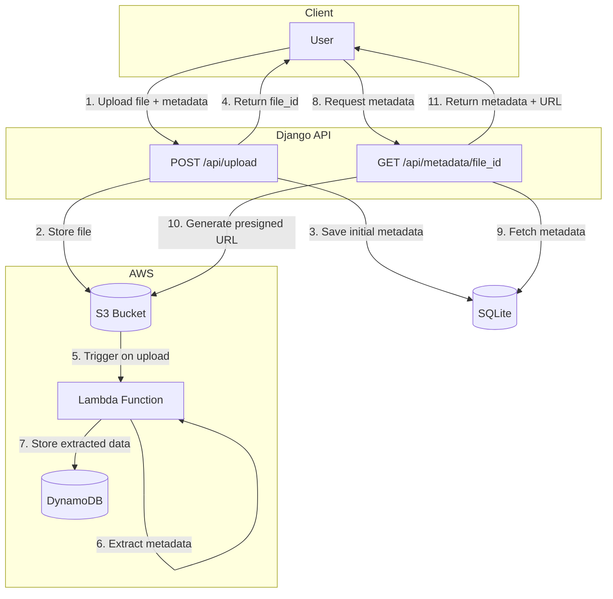

# File Upload & Metadata Extraction Service

A RESTful API service that allows users to upload files to AWS S3 and automatically extracts metadata using AWS Lambda.

## Architecture Overview



## Project Structure

```
backend/
├── core/                          # Django project settings
│   ├── settings.py
│   └── urls.py
├── metadata_extraction/           # Main application
│   ├── models.py                  # FileMetadata model
│   ├── views.py                   # Upload and Metadata views
│   ├── serializers.py             # DRF serializers
│   ├── urls.py                    # API routes
│   ├── exceptions.py              # Custom exceptions
│   ├── tests.py                   # Integration tests
│   └── services/
│       └── s3_service.py          # S3 operations (Singleton)
├── lambda/                        # AWS Lambda function (Node.js)
│   ├── index.js
│   └── package.json
├── requirements.txt
├── .env-example
└── README.md
```

## Design Patterns Used

- **Singleton**: S3Service ensures a single boto3 client instance
- **Repository**: Django ORM abstracts database operations
- **Service Layer**: S3Service encapsulates AWS S3 operations

## API Endpoints

### Upload File
```
POST /api/upload
Content-Type: multipart/form-data

Parameters:
- file: File (required)
- author_name: string (optional)
- expiration_date: date YYYY-MM-DD (optional)

Response: 201 Created
{
    "file_id": "uuid"
}
```

### Get Metadata
```
GET /api/metadata/{file_id}

Response: 200 OK
{
    "id": "uuid",
    "file_name": "document.pdf",
    "file_url": "https://s3.amazonaws.com/...",
    "content_type": "application/pdf",
    "author_name": "John Doe",
    "expiration_date": "2025-12-31",
    "file_size": 102400,
    "page_count": 10,
    "extracted_text": "...",
    "lambda_processed": true,
    "created_at": "2025-12-10T00:00:00Z",
    "updated_at": "2025-12-10T00:00:00Z"
}
```

## Setup Instructions

### Prerequisites

- Python 3.10+
- Node.js 18+
- AWS Account
- AWS CLI configured

### 1. Clone and Install Dependencies

```bash
cd backend
python -m venv venv
.\venv\Scripts\activate  # Windows
pip install -r requirements.txt
```

### 2. Configure Environment Variables

```bash
cp .env-example .env
```

Edit `.env` with your AWS credentials:
```
AWS_ACCESS_KEY_ID=your-access-key
AWS_SECRET_ACCESS_KEY=your-secret-key
AWS_REGION=us-east-1
AWS_S3_BUCKET_NAME=your-bucket-name
```

### 3. Run Migrations

```bash
python manage.py makemigrations
python manage.py migrate
```

### 4. Start the Server

```bash
python manage.py runserver
```

## Testing the API

### Run Unit Tests

```bash
python manage.py test metadata_extraction
```

### Manual API Testing

#### Upload a File

Using curl:
```bash
curl -X POST http://localhost:8000/api/upload \
  -F "file=@document.pdf" \
  -F "author_name=John Doe" \
  -F "expiration_date=2025-12-31"
```

Using Postman:
1. Create a new POST request to `http://localhost:8000/api/upload`
2. Go to Body → form-data
3. Add key `file` (type: File) and select your file
4. Add key `author_name` (type: Text) with value
5. Add key `expiration_date` (type: Text) with date in YYYY-MM-DD format
6. Send the request

#### Get File Metadata

```bash
curl http://localhost:8000/api/metadata/{file_id}
```

## AWS Setup

### S3 Bucket

1. Create an S3 bucket in your AWS console
2. Keep "Block all public access" enabled
3. Note the bucket name for your `.env` file

### DynamoDB Table

```bash
aws dynamodb create-table \
    --table-name FileMetadata \
    --attribute-definitions AttributeName=file_id,AttributeType=S \
    --key-schema AttributeName=file_id,KeyType=HASH \
    --billing-mode PAY_PER_REQUEST
```

### Lambda Function

1. Navigate to the lambda folder:
```bash
cd lambda
npm install
```

2. Create the deployment package:
```bash
# Windows PowerShell
Compress-Archive -Path .\* -DestinationPath function.zip -Force
```

3. Create IAM Role with S3 read and DynamoDB write permissions

4. Deploy the Lambda:
```bash
aws lambda create-function \
    --function-name MetadataExtractor \
    --runtime nodejs18.x \
    --handler index.handler \
    --role arn:aws:iam::YOUR_ACCOUNT:role/LambdaS3DynamoRole \
    --zip-file fileb://function.zip \
    --timeout 30 \
    --memory-size 256
```

5. Configure S3 trigger:
   - Go to S3 bucket → Properties → Event notifications
   - Create event for "All object create events"
   - Prefix: `uploads/`
   - Destination: Lambda function `MetadataExtractor`

## Challenges and Learnings

Working with S3 and DynamoDB was straightforward since I had prior experience with similar workflows. In a previous project, I worked on a pipeline that processed XLSX files, extracted and transformed data, generated PDF reports, and stored them in S3 while saving metadata to DynamoDB.

However, implementing the Lambda function with Node.js was a new experience. Although I have some familiarity with Node.js from building APIs, I had never used it specifically for Lambda functions,  I've always relied on Python for serverless workloads..

## Assumptions

- Files are stored with UUID-based names to ensure uniqueness
- The Lambda function extracts page count and text only for PDF files
- Presigned URLs for file downloads expire after 1 hour
- SQLite is used for local development; production would use PostgreSQL or similar

